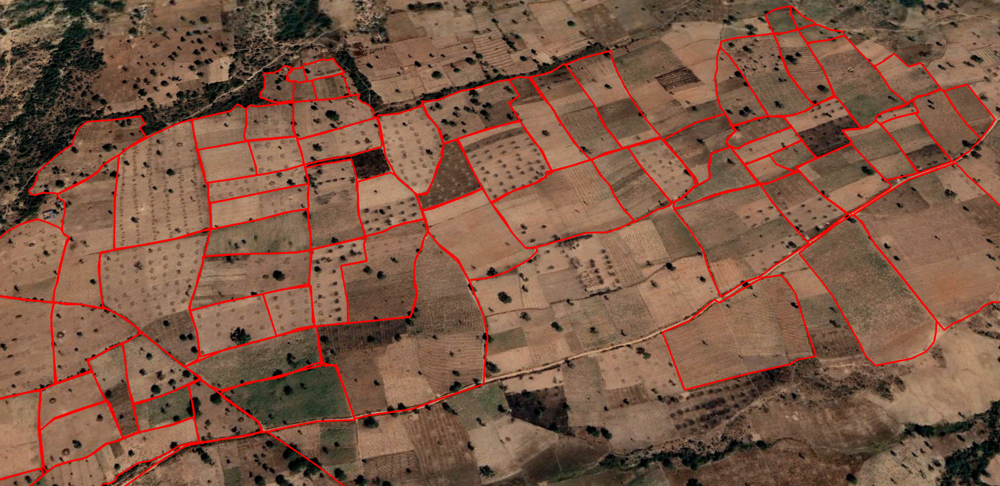
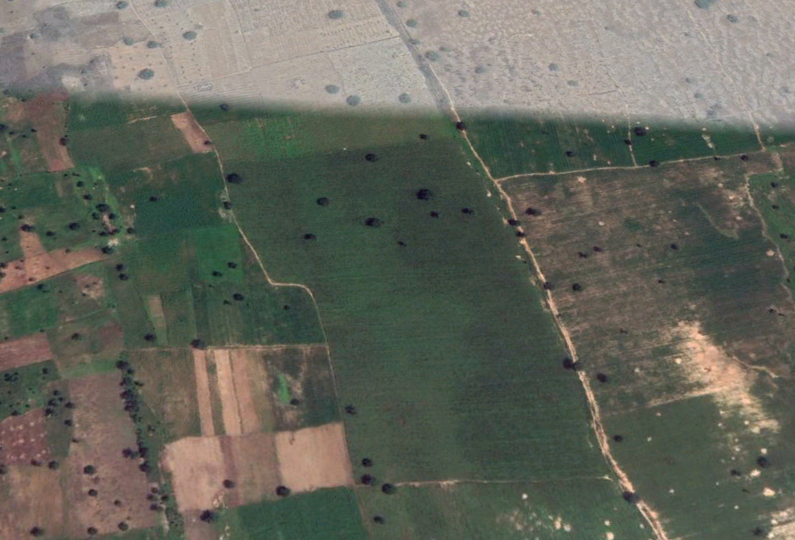
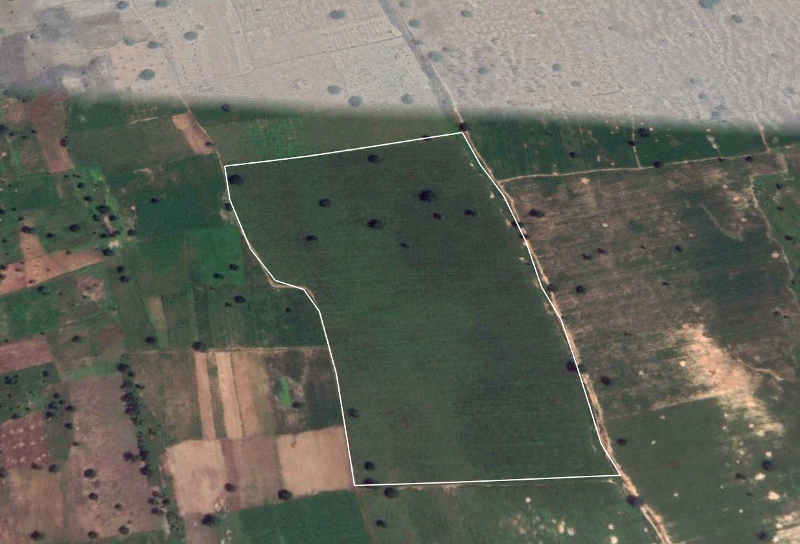

# Crowd Sourcing Platform for Farm Land Annotation

### With Special Focus On Admin Level 1 Boundaries of Nigeria 

fbd-gis-data is a repository for farm boundary annotations using Geospatial Imagery. The repository houses...(to be completed) 

### Progress So Far...

| Grids                  | Annotated           | 
| -----------------------|:-------------------:|
| a1                     |                     |
| a2                     |                     |
| a3                     |                     |
| a4                     |                     |
| b1                     |                     |
| b2                     |                     |
| b3                     |                     |
| b4                     |                     |
| c1                     |                     |
| c2                     | ✓                   |
| c3                     |                     |
| c4                     |                     |
| d1                     |                     |
| d2                     |                     |
| d3                     |                     |
| d4                     |                     |
| e1                     |                     |
| e2                     |                     |
| e3                     |                     |
| e4                     |                     |
| d1                     |                     |
| d2                     |                     |
| d3                     |                     |
| d4                     |                     |

### Recommended Annotation Tools/Software 

Any Geobrowser/Earth Browser (such as Google Earth) that works well with KML (.kml) and Shape (.shp) files, would be fine. 
From our experience, Google Earth Pro  has little to no learning curve for this type of activity so it's easier to start with.

### How Can I Contribute?

You can join us in annotating! To create annotations:

 1. You need to have the Geobrowser ready (of course :) ).
 2. To select a Shapefile or Shapefiles to work with, Open the *Unnanotated* folder and select one of the folders in it, for instance *f1*. In the *f1* folder, there are up to 400 files, each with their id number. Select only the Shapefile with the number you intend to work with e.g id_2.0.shp. 

 **NB**: Please note that you would need to remove the file(s) you choose to work with, so another person does not make the mistake of reselecting. To update the repo after removing the file, kindly create a pull request saying "Selected file(s) <*file name*> in <*folder*>". E.g *Selected file id_2.0.shp in b3*.

 3. Open the Shapefile on the Geobrowser to begin annotating. 
 4. If there is any fill color in the polygon loaded, remove it so you can see the area to be annotated within the polygon.
 5. Depending on the Geobrowser being used, you can zoom in to view the farms and begin annotating. Using Google Earth Pro:

 	- To draw a polygon around a farm, right click on the shapefile at the left side panel, select **Add**, select **Polygon**. A shortcut for this is to use **CTRL + SHIFT + G**. The pop up shows. Select **Style**, **Color**, under the **Area** section, change **Filled + Outlined** to **Outlined**. You can also rename the polygon here. Don’t click **OK** yet.

 	- Then begin drawing the polygon around the farm. When you are done with drawing the particular polygon, click the **OK** button in the pop up.

 6. When annotating, only the outline of the polygon should by shown, as seen in the images below:

	Before annotation:

	

	After annotation:

	

7. When saving, please avoid changing the file name. Also save the file as a KML file.

8. Before making a pull request for your work to be accepted, please ensure the file is saved in the right folder under *Annotated* on the repo. For instnance, if you chose a file from *c3*, please save you annotated file under *c3* in *Annotated*.

### Guidelines For Creating Good Annotations

- Avoid overlapping features. Don’t create a polygon inside another polygon. If there are small farm boundaries inside a bigger one, annotate only the small ones and don’t annotate the big one.

- If an area is not clearly a farm, don’t annotate it.

- Be very careful when drawing the polygons. 

- Take advantage of small farm boundaries.

- Ensure you follow the farm outline neatly. Don’t cut across another polygon or another feature (e,g road, water body).

- We won't be needing the larger polygon that came in the Shapefile (it might be confused to be a farm boundary). So it should be removed.

